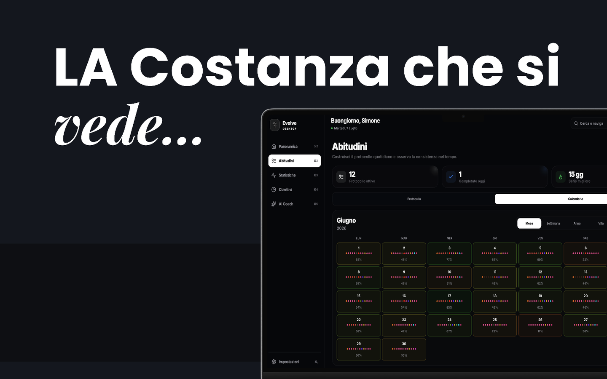
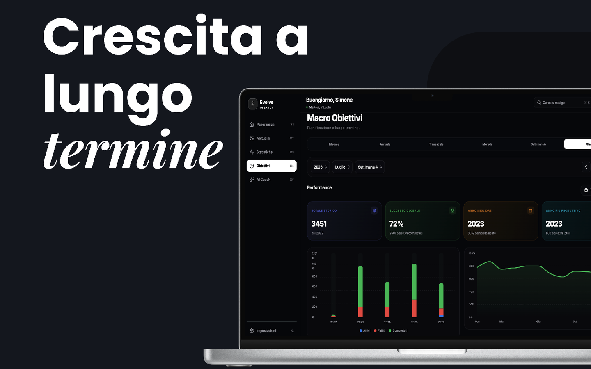
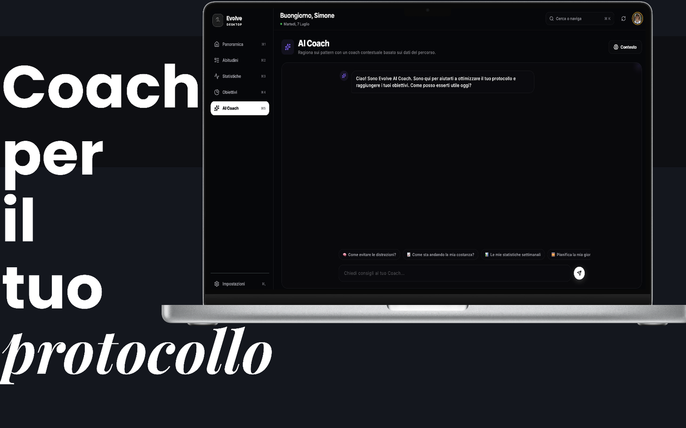

<div align="center">


# Evolve

### Build better habits. Own your data.

[](https://apps.apple.com/app/evolve-habits-goal-tracker/id6770482363)
[](#platforms)
[](#architecture)
[](./LICENSE)

<p><i>"We don't rise to the level of our goals. We fall to the level of our systems." — James Clear</i></p>

</div>

---

**Evolve** is a habit and goal tracker for iPhone, iPad and Mac. Build a daily protocol and hold a streak, plan macro goals from lifetime down to the week, log how you actually felt, and ask a coach that reasons over *your* data — not a generic chatbot.

It runs two ways: a **fully local, encrypted Private mode** that costs nothing and unlocks everything, or a **Cloud mode** that syncs across your devices. You choose which, and you can switch.

> This repository — `mattioli.OS` — is the monorepo behind Evolve: two Flutter clients, a React web client, and a shared Supabase backend.

<div align="center">

<table>
<tr>
<td width="33%"></td>
<td width="33%"></td>
<td width="33%"></td>
</tr>
</table>

</div>

---

## Two ways to use Evolve

The distinction is not "free trial vs paid". It's **where your data lives** — and the private option is the one with nothing held back.

| | 🔒 **Private mode** | ☁️ **Cloud mode** |
| :--- | :--- | :--- |
| **Where data lives** | On your device, in a SQLCipher-encrypted database | Supabase (Postgres) |
| **Account** | None required | Email or Sign in with Apple |
| **Sync** | Optional end-to-end encrypted iCloud/CloudKit sync across your Apple devices | All your devices, plus the web client |
| **Crash reporting** | Never starts — the SDK is torn down, not just muted | Opt-in only, PII-scrubbed, revocable at any time |
| **Price** | **Free — every Pro feature unlocked, no paywall shown** | Free core; **Evolve Pro** subscription unlocks advanced analytics |

Private mode isn't a limited tier. The clients force full entitlement when it's active, and no upgrade prompt is ever displayed — the code treats a private user as entitled by construction.

And because this repo is source-available, **self-hosting the Cloud mode against your own Supabase project has no paywall either.**

---

## Features

| | |
| :--- | :--- |
| **Daily protocol** | Per-habit streaks, per-day-of-week scheduling, quick check-off, month / week / year / lifetime views |
| **Macro goals** | Lifetime → annual → quarterly → monthly → weekly planning, with historical performance and multi-year trends |
| **Statistics** | Completion trends, improvement alerts, per-day-of-week performance, habit correlations, yearly heatmaps |
| **Mood & energy** | A daily check-in that surfaces how your habits actually affect how you feel |
| **AI coach** | Context-aware coaching over your own history. Desktop runs it against a **local Ollama** model, so it never leaves your machine |
| **Privacy** | Local SQLCipher encryption, E2E-encrypted CloudKit sync (AES-GCM), biometric lock, no ads, no tracking |
| **Localised** | English, Italian, Spanish, German, Arabic — including full RTL |

---

## Platforms

| Client | Runs on | Stack | Availability |
| :--- | :--- | :--- | :--- |
| **[`mobile/`](./mobile)** | iOS 16+ · iPadOS · Android | Flutter · Riverpod · go_router | **[On the App Store](https://apps.apple.com/app/evolve-habits-goal-tracker/id6770482363)** (iOS). Android builds from source; not published. |
| **[`desktop/`](./desktop)** | macOS 12.3+ · Windows · Linux | Flutter · Riverpod | Build from source — see [`desktop/README.md`](./desktop/README.md) |
| **[`web-app/`](./web-app)** | Any browser | React 18 · Vite 7 · Tailwind | The [Mattioli.OS website](https://simo-hue.github.io/mattioli.OS/) + browser tracker |

### iPhone & iPad

The primary client. Offline-first, 60/120 FPS, biometric lock, and the full Private-mode stack with encrypted iCloud sync.

<div align="center">
<table>
<tr>
<td width="50%"></td>
<td width="50%"></td>
</tr>
</table>
</div>

<div align="center">
  <a href="https://apps.apple.com/app/evolve-habits-goal-tracker/id6770482363">
    
  </a>
</div>

### Mac, Windows & Linux

A native desktop client — not a wrapped web page. Keyboard-first: `⌘1`–`⌘5` to move between sections, `⌘K` for a fuzzy command palette that jumps straight to any habit or goal, and arrow-key paging through periods. On macOS it adds encrypted CloudKit sync and a local Ollama-backed AI coach.

<div align="center">



<table>
<tr>
<td width="50%"></td>
<td width="50%"></td>
</tr>
</table>

</div>

### Web

The [Mattioli.OS website](https://simo-hue.github.io/mattioli.OS/) and a browser-based tracker, served from one Vite build. See [`web-app/README.md`](./web-app/README.md).

---

## Architecture

Three clients, one shared backend. The Flutter clients share their sync and verification cores as local Dart packages.

```text
mattioli.OS/
├── mobile/            Flutter — iOS · iPadOS · Android
├── desktop/           Flutter — macOS · Windows · Linux
├── web-app/           React + Vite — website + browser tracker
├── packages/
│   ├── evolve_sync/          E2E-encrypted CloudKit sync core (AES-GCM)
│   └── evolve_verification/  Habit auto-verification engine
├── schema.sql         Postgres schema — the single source of truth
├── migrations/        Versioned SQL migrations (shared by all clients)
├── supabase/          Edge functions — RevenueCat webhook, Apple token revocation
└── docs/              User manuals, contribution guide, assets
```

`schema.sql` and `migrations/` live at the root deliberately: all three clients depend on them, and `mobile/test/schema_drift_test.dart` fails CI if any `.rpc()` or view the app calls is missing a definition — so the schema can't silently drift from the code.

---

## Development

Each client is a self-contained project root. Build the one you need.

```bash
git clone https://github.com/simo-hue/mattioli.OS.git
cd mattioli.OS
```

| Client | Commands |
| :--- | :--- |
| **Mobile** | `cd mobile && flutter pub get && dart run slang && flutter run` |
| **Desktop** | `cd desktop && flutter pub get && flutter run -d macos` |
| **Web** | `cd web-app && npm install && npm run dev` |

Both Flutter clients need local config files that are git-ignored for secrets — copy the `.example` templates in `mobile/lib/core/` and fill them in. Full instructions: [`mobile/README.md`](./mobile/README.md) · [`desktop/README.md`](./desktop/README.md) · [`web-app/README.md`](./web-app/README.md).

For the backend, run [`schema.sql`](./schema.sql) in your own Supabase project.

---

## Privacy

- **No ads, no third-party tracking, no data resale.** There is no advertising or analytics SDK in either client.
- **Private mode keeps everything on-device**, in a SQLCipher-encrypted database. Crash reporting doesn't run at all — the SDK is shut down rather than merely silenced, because muting the logger alone would leave the native crash handler reporting.
- **Crash reporting is opt-in, never assumed.** The first launch stays silent until you're actually asked; events are PII-scrubbed (emails, tokens, secrets) before leaving the device, and you can withdraw consent later.
- **iCloud sync is end-to-end encrypted** (AES-GCM) — payloads are encrypted on-device before they reach CloudKit.
- **Cloud mode** stores only what you enter, behind Postgres row-level security.
- **Account deletion is a first-class action** and removes your data server-side.

Full details: [Privacy Policy](https://simo-hue.github.io/mattioli.OS/privacy).

---

## Documentation

| 🇺🇸 English | 🇮🇹 Italiano |
| :--- | :--- |
| [User Manual](./docs/TUTORIAL_USER_EN.md) | [Manuale Utente](./docs/TUTORIAL_USER_IT.md) |
| [Web Technical Guide](./web-app/docs/TUTORIAL_TECH_EN.md) | [Guida Tecnica Web](./web-app/docs/TUTORIAL_TECH_IT.md) |

- [Technical Deep Dive](./web-app/docs/TECHNICAL_DEEP_DIVE.md) — web architecture, state, RLS
- [Habit Statistics Audit](./docs/HABIT_STATS_AUDIT.md) — how every statistic is derived, verified across SQL, mobile and desktop
- [Contributing](./docs/CONTRIBUTING.md)

---

## Philosophy

Evolve is opinionated. It assumes:

1. **Friction is the enemy.** Logging a day must take seconds, or you won't do it.
2. **Privacy is not a feature.** It's the default — which is why the private tier is the free one.
3. **Aesthetics matter.** A tool you find ugly is a tool you'll abandon.

---

## License

[PolyForm Noncommercial 1.0.0](./LICENSE) — free to use, modify and self-host for any noncommercial purpose.

<div align="center">
  <br />
  Built by <b>Simone Mattioli</b>
  <br />
</div>
