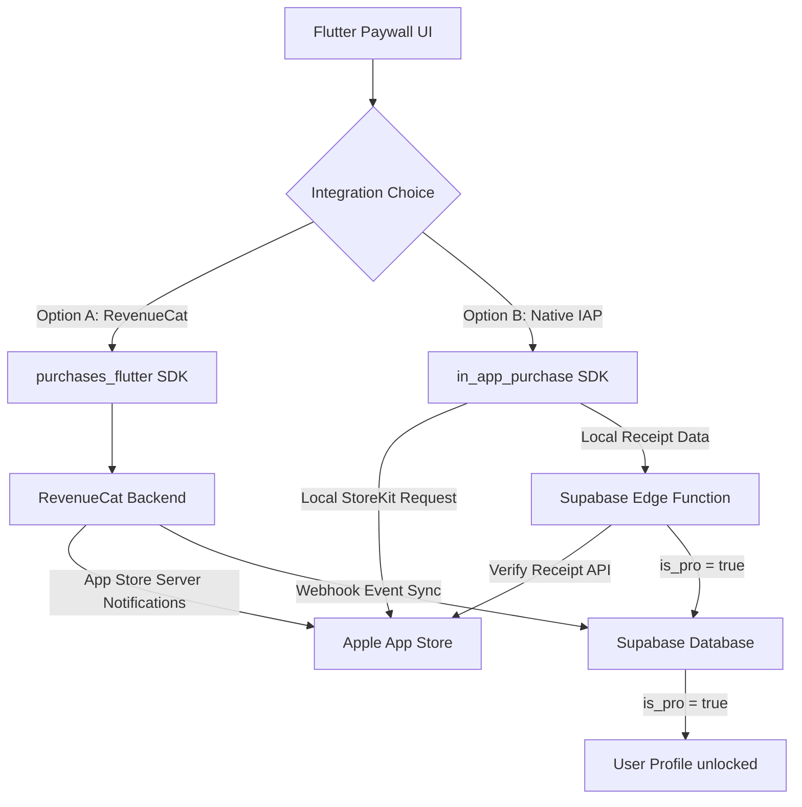

# 🍎 Apple Auto-Renewable Subscriptions: Implementation & Compliance Plan

This document outlines the architecture, setup procedure, and compliance requirements to integrate real monthly subscriptions (Auto-Renewable Subscriptions) on iOS for **Evolve**.

---

## 📊 Architectural Overview: Two Paths

To charge for subscriptions on iOS, you must use Apple's StoreKit framework. In Flutter, there are two primary ways to interface with it:



### Option A: RevenueCat (`purchases_flutter`) — *RECOMMENDED*
RevenueCat is the industry standard. It acts as a middleware between Apple StoreKit and your backend.
*   **Pros:**
    *   **Zero Receipt Validation Logic:** Receipts are validated server-side by RevenueCat, making it completely secure against local client-side bypasses (e.g. jailbreak tools).
    *   **No App Store Server Notifications to write:** RevenueCat handles subscription state changes (renewals, cancellations, billing issues, refunds) out-of-the-box.
    *   **Direct Supabase Sync:** RevenueCat can send webhook events directly to a Supabase Edge Function to update your `profiles` table's `is_pro` field.
    *   **Out-of-the-box Charting & Analytics:** LTV, MRR, Churn rate, Cohorts, etc. are automatically tracked.
    *   **Dynamic UI (Optional):** Supports server-configured paywalls.
*   **Cons:** Free tier is extremely generous (up to $10,000 in monthly tracked revenue), after which it is a small percentage.

### Option B: Native `in_app_purchase` + Supabase Edge Functions
Direct communication between your app, Apple, and a custom backend.
*   **Pros:** 100% free (no RevenueCat fees).
*   **Cons:**
    *   You must implement server-side receipt validation yourself inside a Supabase Edge Function using Apple's App Store Server API (StoreKit 2).
    *   You must configure and maintain an HTTP endpoint to process **App Store Server Notifications V2** (extremely complex: handling JSON Web Signatures, caching, certificate verification, and mapping all possible billing event types).
    *   Failing to implement server-side validation allows jailbroken users to bypass the purchase flow in under 2 minutes.

> [!IMPORTANT]
> **Verdict:** We strongly recommend **Option A (RevenueCat)**. It reduces deployment time from weeks to hours, ensures bulletproof security, and integrates seamlessly with Supabase.

---

## 📋 Apple Compliance Checklist (Avoid Rejections!)

Apple has extremely strict guidelines regarding Auto-Renewable Subscriptions (Guideline 3.1.2). The reviewer **will** reject the app if any of these elements are missing from the Paywall/Subscription screen:

1.  **Dynamic Pricing & Currency:**
    *   You **must not** hardcode `"€4,99"` or `"€"` on the button.
    *   The app must fetch the price dynamically from the App Store and display it in the user's localized currency (e.g., `$4.99` if using a US App Store account, `£4.49` for UK, etc.).
2.  **Explicit Billing Terms:**
    *   The paywall must state clearly:
        *   Title of the subscription (e.g., "Evolve Pro Mensile").
        *   Cost & period (e.g., "€4.99 al mese").
        *   Billing frequency: "Rinnovo automatico mensile a meno che non venga disattivato nelle impostazioni dell'account Apple almeno 24 ore prima del termine."
3.  **Terms of Use (EULA) & Privacy Policy Links:**
    *   Must be explicitly visible on the paywall screen.
    *   You can link to your website's Privacy Policy (`https://simo-hue.github.io/mattioli.OS/`) and the standard **Apple EULA** (`https://www.apple.com/legal/internet-services/itunes/dev/stdeula/`).
4.  **Restore Purchases Button ("Ripristina Acquisti"):**
    *   Must be clearly visible.
    *   Must actually work. If a user deletes the app and reinstalls it, they must be able to restore their Pro status without paying again.

---

## 🛠️ Step-by-Step Setup Guide

### STEP 1: App Store Connect Agreements & Products
1.  **Paid Applications Agreement:**
    *   Log in to [App Store Connect](https://appstoreconnect.apple.com/).
    *   Go to **Business** > **Agreements**.
    *   Add your banking details, tax information (W-8BEN-E or standard IT forms), and sign the **Paid Applications** agreement. *Without this, In-App Purchases will fail to load or purchase.*
2.  **Create Subscription Group:**
    *   Go to **Apps** > select **Evolve**.
    *   In the left sidebar, click **Subscriptions** (under Features).
    *   Click **Create** under *Subscription Groups*. Name it `Evolve_Pro_Group`.
3.  **Create Auto-Renewable Subscription:**
    *   Inside the group, click **+** under *Subscriptions*.
    *   **Reference Name:** `Evolve Pro Mensile` (Internal identifier).
    *   **Product ID:** `com.simo.evolve.pro.monthly` (This is critical: you will use this exact ID in your code/RevenueCat).
4.  **Configure Pricing & Duration:**
    *   Set **Subscription Duration** to **1 Month**.
    *   Under **Subscription Prices**, set the price for your primary country (e.g., Italy: €4.99). Apple will automatically calculate matching prices in all other 175 currencies.
5.  **Review Details:**
    *   Add a localized description (e.g., Italian - Display Name: `Evolve Pro Mensile`, Description: `Sblocca statistiche avanzate, AI coach personalizzato, protezione biometrica e sincronizzazione cloud.`).
    *   **Review Screenshot:** Upload a screenshot of your paywall screen (an image showing the pricing and subscription details). This is required for Apple to review the IAP product.

### STEP 2: Configure RevenueCat
1.  **Create Project:**
    *   Sign up at [RevenueCat](https://www.revenuecat.com/).
    *   Create a project named `Evolve`.
2.  **Add App (App Store Connect Integration):**
    *   Go to **Project Settings** > **Apps** > **Add App** > **App Store**.
    *   **App Name:** `Evolve`
    *   **Bundle ID:** `com.simo.evolve`
    *   **App Store Connect Shared Secret:**
        *   In App Store Connect, go to **Users and Access** > **Shared Secrets** (or directly under your App > Subscriptions > Shared Secret).
        *   Generate a **Primary Shared Secret** and paste it into RevenueCat.
3.  **Define Entitlements & Offerings:**
    *   **Entitlement:** Create an entitlement called `pro_access` (this is the key that represents "having Premium features unlocked").
    *   **Product:** Add a product, matching the App Store Product ID: `com.simo.evolve.pro.monthly`. Associate it with your App Store app.
    *   **Offering:** Create an offering called `default` (or `pro_plans`).
    *   **Package:** Inside the offering, add a **Monthly** package and link it to the `com.simo.evolve.pro.monthly` product.

### STEP 3: Connect RevenueCat Webhooks to Supabase (Database Sync)
To make sure `is_pro` is perfectly synced in your database:
1.  Create a Supabase Edge Function (e.g., `revenuecat-webhook`).
2.  When a user signs up in the app, set their RevenueCat **App User ID** to their Supabase **Auth UUID**:
    ```dart
    await Purchases.logIn(supabaseUserUuid);
    ```
3.  In RevenueCat, go to **Integrations** > **Webhooks** > **Add Webhook** and point it to your Supabase Edge Function URL.
4.  The Edge Function will receive JSON payloads whenever subscriptions are purchased, renewed, or expired.
5.  In the Edge Function, check the event type:
    *   `INITIAL_PURCHASE` / `RENEWAL` / `RESTORE` -> Update user's profile where `id = app_user_id` and set `is_pro = true`.
    *   `EXPIRATION` / `CANCELLATION` (with immediate expiration) -> Set `is_pro = false`.
    *   This secures your data architecture: the client doesn't self-grant PRO status; the server updates the database based on cryptographically validated Apple events.

---

## 💻 Flutter Integration Code Guide

Here is exactly how the Flutter code will be structured.

### 1. Dependencies
Add the official RevenueCat package to `mobile/pubspec.yaml`:
```yaml
dependencies:
  purchases_flutter: ^8.0.0 # Check latest stable
```

### 2. Initialization Service (`lib/core/services/subscription_service.dart`)
We will create a dedicated provider to manage the purchase SDK:

```dart
import 'dart:io';
import 'package:flutter/foundation.dart';
import 'package:flutter_riverpod/flutter_riverpod.dart';
import 'package:purchases_flutter/purchases_flutter.dart';
import '../../providers/settings_provider.dart';

final subscriptionServiceProvider = Provider((ref) => SubscriptionService(ref));

class SubscriptionService {
  final Ref _ref;
  
  SubscriptionService(this._ref);
  
  static const _apiKey = 'appl_YOUR_REVENUECAT_PUBLIC_API_KEY'; // From RevenueCat Dashboard

  Future<void> init(String userUuid) async {
    try {
      await Purchases.setLogLevel(kDebugMode ? LogLevel.debug : LogLevel.error);
      
      // Configure RevenueCat
      PurchasesConfiguration configuration = PurchasesConfiguration(_apiKey)
        ..appUserID = userUuid;
      await Purchases.configure(configuration);
      
      // Check current subscription status immediately
      await checkAndSyncStatus();
    } catch (e) {
      debugPrint('Errore inizializzazione RevenueCat: $e');
    }
  }

  /// Checks subscription status directly from Apple/RevenueCat and syncs it to local settings
  Future<bool> checkAndSyncStatus() async {
    try {
      CustomerInfo customerInfo = await Purchases.getCustomerInfo();
      // "pro_access" matches the Entitlement ID set on RevenueCat dashboard
      final isProActive = customerInfo.entitlements.all['pro_access']?.isActive ?? false;
      
      // Update our global state
      final currentSettings = _ref.read(settingsProvider);
      if (currentSettings.isPro != isProActive) {
        await _ref.read(settingsProvider.notifier).updateSettings(
          currentSettings.copyWith(isPro: isProActive),
        );
      }
      return isProActive;
    } catch (e) {
      debugPrint('Errore controllo stato abbonamento: $e');
      return false;
    }
  }

  /// Fetches the dynamic monthly package details (price, currency)
  Future<Package?> getMonthlyPackage() async {
    try {
      Offerings offerings = await Purchases.getOfferings();
      if (offerings.current != null && offerings.current!.monthly != null) {
        return offerings.current!.monthly;
      }
    } catch (e) {
      debugPrint('Errore recupero piani d\'abbonamento: $e');
    }
    return null;
  }

  /// Launch purchase flow
  Future<bool> purchaseMonthly(Package package) async {
    try {
      CustomerInfo customerInfo = await Purchases.purchasePackage(package);
      final isProActive = customerInfo.entitlements.all['pro_access']?.isActive ?? false;
      
      final currentSettings = _ref.read(settingsProvider);
      await _ref.read(settingsProvider.notifier).updateSettings(
        currentSettings.copyWith(isPro: isProActive),
      );
      
      return isProActive;
    } catch (e) {
      debugPrint('Acquisto annullato o fallito: $e');
      return false;
    }
  }

  /// Restore purchases
  Future<bool> restorePurchases() async {
    try {
      CustomerInfo customerInfo = await Purchases.restorePurchases();
      final isProActive = customerInfo.entitlements.all['pro_access']?.isActive ?? false;
      
      final currentSettings = _ref.read(settingsProvider);
      await _ref.read(settingsProvider.notifier).updateSettings(
        currentSettings.copyWith(isPro: isProActive),
      );
      
      return isProActive;
    } catch (e) {
      debugPrint('Errore ripristino acquisti: $e');
      return false;
    }
  }
}
```

### 3. Compliant Paywall Screen UI changes (`lib/ui/screens/subscription_screen.dart`)
We will transform the mock screen to dynamically load products and comply with Apple:

```dart
// 1. Fetch package dynamically on build / init:
// We use a StateProvider or FutureProvider to fetch the Monthly package from SubscriptionService.

// 2. Add Compliance Links in your layout (EULA & Privacy Policy):
Row(
  mainAxisAlignment: MainAxisAlignment.center,
  children: [
    TextButton(
      onPressed: () => launchUrl(Uri.parse('https://simo-hue.github.io/mattioli.OS/')),
      child: const Text('Privacy Policy', style: TextStyle(fontSize: 11, decoration: TextDecoration.underline)),
    ),
    const Text('•', style: TextStyle(fontSize: 11)),
    TextButton(
      onPressed: () => launchUrl(Uri.parse('https://www.apple.com/legal/internet-services/itunes/dev/stdeula/')),
      child: const Text('Termini d\'Uso (EULA)', style: TextStyle(fontSize: 11, decoration: TextDecoration.underline)),
    ),
  ],
)

// 3. Add Restore Button in the AppBar or below the main button:
TextButton.icon(
  icon: const Icon(LucideIcons.rotateCcw, size: 14),
  label: const Text('Ripristina Acquisti'),
  onPressed: () async {
    setState(() => _isLoading = true);
    final restored = await ref.read(subscriptionServiceProvider).restorePurchases();
    setState(() => _isLoading = false);
    
    if (restored) {
      ScaffoldMessenger.of(context).showSnackBar(const SnackBar(content: Text('Acquisti ripristinati con successo!')));
    } else {
      ScaffoldMessenger.of(context).showSnackBar(const SnackBar(content: Text('Nessun abbonamento attivo trovato.')));
    }
  },
)
```

---

## 🚀 Recommended Immediate Next Steps

1.  **Banking & Agreements Setup:** Confirm your "Paid Applications" agreement in App Store Connect so Apple enables StoreKit API queries for your bundle ID.
2.  **RevenueCat Account Creation:** Set up the free account and insert your Bundle ID.
3.  **Code Scaffolding:** Let's write the `subscription_service.dart` file and update `pubspec.yaml` to include `purchases_flutter`.
4.  **UI Updates:** Update the `SubscriptionScreen` to display dynamic data and compliance details.

Would you like me to start by **setting up the local Dart services and updating the paywall UI** so it is ready to connect as soon as you have finished the App Store Connect details?
