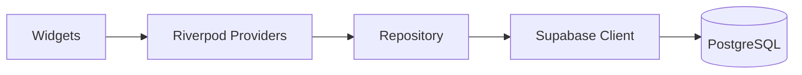

# 🏗️ Backend Architecture Guide: From Personal Tool to Global Scale

Benvenuto, Collega. Passare da un tool personale a un'applicazione pronta per il mercato (App Store) richiede un cambio di paradigma significativo. Non si tratta più solo di far funzionare le cose, ma di garantire **sicurezza**, **integrità dei dati**, **performance** e **manutenibilità** a lungo termine.

In questa guida analizzeremo come trasformare il backend di **Mattioli.OS** in una soluzione professionale.

---

## 🏛️ 1. L'Architettura del Backend Professional

Quando si scala per più utenti, il backend deve gestire tre pilastri fondamentali:

1.  **Identità (Auth):** Chi è l'utente?
2.  **Isolamento (Multi-tenancy):** Come garantisco che l'utente A non veda i dati dell'utente B?
3.  **Integrità (Business Logic):** Come evito che il client (l'app mobile) invii dati corrotti o illogici?

---

## ⚡ 2. Analisi dei Tool: Supabase vs Firebase vs Others

### 🚀 Supabase (Consigliato: Continuità & Potenza SQL)
Dato che lo stai già usando, Supabase è la scelta più logica. È basato su **PostgreSQL**, il database relazionale più solido al mondo.

*   **Punto di Forza (RLS):** La *Row Level Security* (RLS) ti permette di definire le regole di accesso direttamente nel database. Invece di scrivere filtri complessi nell'app (`where user_id = current_user`), il database lo fa per te in modo nativo e sicuro.
*   **Scalabilità:** PostgreSQL gestisce milioni di record senza battere ciglio. Con Supabase hai anche gli **Edge Functions** (Deno) per logica server-side veloce e vicina all'utente.
*   **Pro:** SQL completo, Relazioni (JOIN), Auth integrato, Real-time tramite WAL.
*   **Contro:** Richiede una conoscenza minima di SQL per le query più avanzate.

### 🔥 Firebase (Lo Standard Industry)
Firebase è l'ecosistema di Google. È un database NoSQL (Document-based).

*   **Punto di Forza:** Integrazione plug-and-play con Flutter (entrambi Google). Le notifiche (FCM) e l'Analytics sono i migliori sul mercato.
*   **Scalabilità:** Quasi infinita, ma i costi possono esplodere se non ottimizzi le letture (si paga per ogni documento letto/scritto).
*   **Pro:** Semplicità estrema, documentazione sterminata, integrazione nativa con Google Cloud.
*   **Contro:** *Vendor Lock-in* totale (difficile migrare via), query complesse limitate (niente JOIN).

### 🛠️ Appwrite (L'alternativa Open Source)
Appwrite è molto simile a Firebase ma è open-source e può essere self-hosted.

*   **Punto di Forza:** Privacy-first. Puoi ospitarlo sui tuoi server (es. un VPS in Italia) per avere il controllo totale dei dati.
*   **Pro:** API pulitissima, supporto Docker eccellente.
*   **Contro:** Community più piccola rispetto ai due colossi sopra.

---

## 🛠️ 3. Come strutturare Supabase per la Produzione

Se decidi di restare su Supabase (che ti consiglio vivamente per la natura relazionale di Mattioli.OS — abitudini, obiettivi, log), ecco come farlo professionalmente:

### A. Row Level Security (RLS) - MANDATORIO
Non fidarti mai del client. Ogni tabella deve avere l'RLS abilitato.
```sql
-- Esempio: Solo il proprietario può vedere i propri obiettivi
ALTER TABLE goals ENABLE ROW LEVEL SECURITY;

CREATE POLICY "Users can only see their own goals" 
ON goals FOR SELECT 
USING (auth.uid() = user_id);
```

### B. Database Migrations
Non modificare più le tabelle dalla dashboard UI. Usa le **Migrations**. Questo ti permette di:
1. Versionare il database (come fai con il codice).
2. Avere un ambiente di "Staging" (test) identico a quello di "Production".

### C. Edge Functions per la Logica AI
L'AI Coach di Mattioli.OS non dovrebbe girare solo sul client (rischio di timeout, consumo batteria). Sposta la logica pesante su **Supabase Edge Functions**. Questo ti permette di nascondere le tue API Keys (es. OpenAI/Anthropic) e non esporle nell'app.

---

## 🏗️ 4. Architettura Mobile (Flutter Side)

Per reggere il carico e non impazzire con i bug, devi separare le responsabilità. Non chiamare Supabase direttamente dai widget.

### Il Pattern "Repository"
1.  **Data Source:** Il client Supabase (`supabase.from('goals')...`).
2.  **Repository:** Una classe che fa da "ponte". Prende i dati grezzi e li trasforma in oggetti Dart (Models). Gestisce anche l'error handling (es. "Nessuna connessione").
3.  **Providers (Riverpod):** I Notifier ascoltano il Repository e notificano la UI.



---

## 📈 5. Roadmap per la Pubblicazione

1.  **Ambiente di Produzione:** Crea un nuovo progetto Supabase dedicato alla produzione. Non usare quello di sviluppo.
2.  **Caching Locale:** Usa `Hive` o `Isar` nel cellulare per salvare i dati offline. Un utente non dovrebbe vedere una schermata bianca se non ha internet.
3.  **Error Monitoring:** Integra **Sentry** o **Firebase Crashlytics**. Devi sapere se l'app crasha prima che te lo dica l'utente con una recensione da 1 stella.
4.  **Legal/GDPR:** Dato che gestisci dati personali (abitudini, mood), assicurati di avere una Privacy Policy chiara e la possibilità per l'utente di cancellare l'account (obbligatorio per App Store).

---

## ⚖️ Il mio verdetto finale

Resta su **Supabase**. 
Per un OS di produttività come il tuo, la struttura dei dati è fondamentale. Le relazioni tra Abitudini, Streak e Macro Goal sono molto più semplici da gestire con SQL che con le collezioni NoSQL di Firebase.

**Prossimo step consigliato:**
Iniziare a implementare l'Auth in Flutter e migrare i tuoi `MockData` nel `macro_goals_provider.dart` verso chiamate asincrone al Repository.

---
*Documentazione redatta da Antigravity - Senior Flutter Developer*
