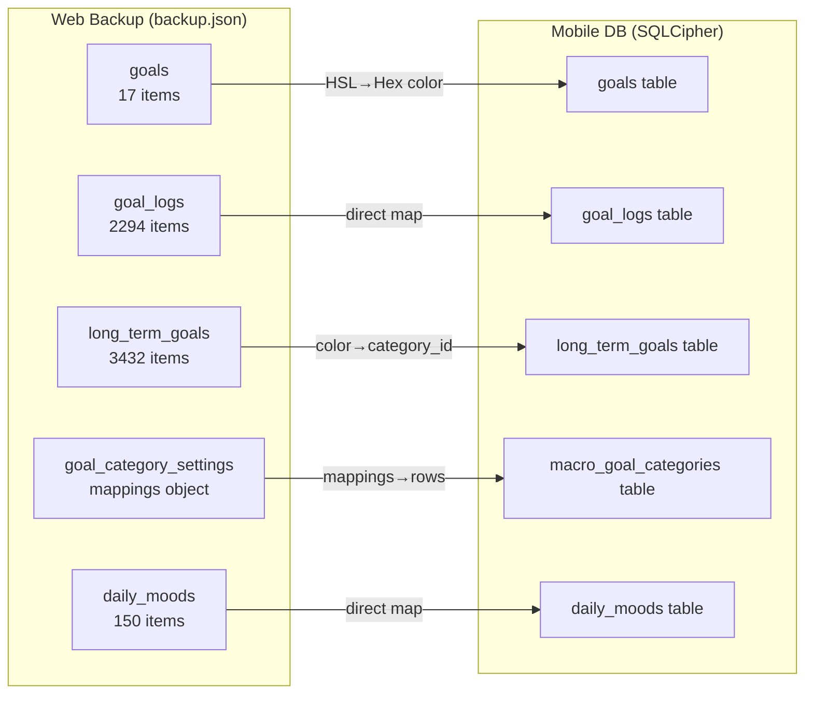

# Import Web Backup to Mobile App

Import data from the Mattioli.OS web app's ZIP backup into the iOS/mobile app, enabling users to migrate their habits, logs, macro goals, categories, and mood data.

## Design Decisions (Resolved)

| Decision | Choice |
|---|---|
| UI placement | Next to existing "Export Data" button in [privacy_settings_screen.dart](file:///Users/simo/Developer/mattioli.OS/mobile/lib/ui/screens/privacy_settings_screen.dart#L154-L163) |
| File format | ZIP only (as exported by web app) |
| Conflict strategy | User chooses between **Replace** (wipe + import) or **Merge** (add/update, skip duplicates) |
| Import scope | All compatible data types at once |
| Color conversion | HSL → Hex at import time |
| Category mapping | Convert web's `goal_category_settings.mappings` → `macro_goal_categories` rows, remap `long_term_goals.color` → `category_id` |
| UX flow | Confirmation dialog with preview + progress indicator |
| Data mode | Works in both Private and Cloud modes |
| UUID handling | Keep original IDs in Replace mode; generate new IDs in Merge mode |
| Localization | All 5 languages (en, it, de, es, ar) |
| Discarded data | `user_memos`, `user_settings`, `reading_logs` — not imported |

---

## Data Mapping (Web → Mobile)



### Key Transformations

1. **Colors**: `hsl(187 94% 47%)` → `#05C3DE` (proper HSL→RGB→Hex conversion)
2. **Categories**: Web's `goal_category_settings.mappings` (keyed by color name like `"red"`, `"purple"`) → individual `macro_goal_categories` rows with generated UUIDs
3. **Macro goal category link**: `long_term_goals.color` (e.g., `"purple"`) → `long_term_goals.category_id` (UUID of the corresponding new category row)
4. **Goal fields**: Web goals lack `description`, `icon`, `frequency_days`, `reminder_time` — these remain null. Mobile `Goal.fromJson` expects `color` as hex (currently), so we convert before passing.
5. **Goal log fields**: Web logs lack `streak` — defaults to 0

---

## Proposed Changes

### New: Import Service

#### [NEW] [backup_import_service.dart](file:///Users/simo/Developer/mattioli.OS/mobile/lib/core/backup_import_service.dart)

Core import logic, independent of UI. Responsibilities:
- Parse ZIP → extract `backup.json`
- Validate backup structure (check `version`, required keys)
- HSL → Hex color conversion utility
- Category mapping logic (web mappings → `macro_goal_categories` + remap `long_term_goals`)
- Build preview summary (counts per data type)
- Execute import in Replace mode (transaction: wipe → insert)
- Execute import in Merge mode (upsert, skip existing by ID)
- Works with both `PrivateLocalDatabase` (private mode) and Supabase providers (cloud mode)

> [!IMPORTANT]
> A new dependency `archive` is needed for ZIP extraction. This is a pure-Dart package, no native code.

---

### Modify: Privacy Settings Screen

#### [MODIFY] [privacy_settings_screen.dart](file:///Users/simo/Developer/mattioli.OS/mobile/lib/ui/screens/privacy_settings_screen.dart)

Add "Import Data" action row right after the "Export Data" row (~line 163). The flow:
1. User taps "Import Data" → `file_picker` opens for `.zip` selection
2. Parse ZIP, extract `backup.json`, validate
3. Show confirmation dialog with:
   - Data preview (habits count, logs count, macro goals count, moods count)
   - Replace / Merge toggle
4. On confirm → show progress indicator → run import → show success/error
5. Invalidate all affected providers to refresh UI

> [!IMPORTANT]
> A new dependency `file_picker` is needed for file selection on iOS. This package handles the iOS document picker natively.

---

### Modify: Data Store Interface + Implementation

#### [MODIFY] [private_data_store.dart](file:///Users/simo/Developer/mattioli.OS/mobile/lib/core/private_data_store.dart)

Add `importData` method to the interface:
```dart
Future<void> importData({
  required Map<String, dynamic> backupData,
  required bool replaceExisting,
});
```

#### [MODIFY] [private_local_database.dart](file:///Users/simo/Developer/mattioli.OS/mobile/lib/core/private_local_database.dart)

Implement `importData` — runs a single SQLite transaction for atomicity:
- **Replace mode**: `DELETE` all user data tables → bulk `INSERT`
- **Merge mode**: `INSERT OR IGNORE` for each record (skip existing)

---

### Modify: Localization Files

#### [MODIFY] [en.i18n.json](file:///Users/simo/Developer/mattioli.OS/mobile/lib/i18n/en.i18n.json)

Add new strings to `privacy` section:
```json
"importData": "Import Data",
"importDataSubtitle": "From Mattioli.OS web backup (ZIP)",
"importPreviewTitle": "Import Preview",
"importPreviewHabits": "{count} habits",
"importPreviewLogs": "{count} habit logs",
"importPreviewMacroGoals": "{count} macro goals",
"importPreviewCategories": "{count} categories",
"importPreviewMoods": "{count} mood records",
"importModeReplace": "Replace all data",
"importModeMerge": "Merge with existing",
"importModeReplaceDesc": "Deletes current data and imports backup",
"importModeMergeDesc": "Keeps current data, adds new items",
"importConfirm": "Import",
"importSuccess": "Data imported successfully!",
"importError": "Import failed: {error}",
"importInProgress": "Importing data...",
"importInvalidFile": "Invalid backup file",
"importInvalidFormat": "The selected file is not a valid Mattioli.OS backup"
```

#### [MODIFY] [it.i18n.json](file:///Users/simo/Developer/mattioli.OS/mobile/lib/i18n/it.i18n.json), [de.i18n.json](file:///Users/simo/Developer/mattioli.OS/mobile/lib/i18n/de.i18n.json), [es.i18n.json](file:///Users/simo/Developer/mattioli.OS/mobile/lib/i18n/es.i18n.json), [ar.i18n.json](file:///Users/simo/Developer/mattioli.OS/mobile/lib/i18n/ar.i18n.json)

Same keys, translated to each language.

---

### Dependencies

#### [MODIFY] [pubspec.yaml](file:///Users/simo/Developer/mattioli.OS/mobile/pubspec.yaml)

Add:
```yaml
archive: ^4.0.2       # ZIP extraction (pure Dart)
file_picker: ^8.1.7    # iOS document picker for file selection
```

---

## Verification Plan

### Automated Tests
```bash
flutter build ios --no-codesign   # Verify compilation
```

### Manual Verification
1. Export a backup from the web app
2. Open the mobile app → Privacy & Data → Import Data
3. Select the ZIP file
4. Verify the preview shows correct counts
5. Test both Replace and Merge modes
6. Verify all data appears correctly in the app (habits, macro goals, moods)
7. Verify HSL colors converted correctly
8. Verify macro goal categories mapped correctly
